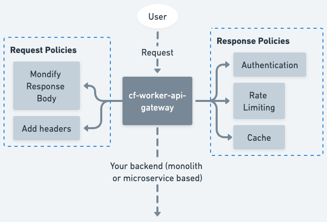

# Cloudflare Workers Edge API Gateway



This is an API Gateway that can be deployed to the Edge with Cloudflare Workers.

Just create a [configuration file](./src/config.json) listing the gateway features of your choice and deploy the API Gateway to Cloudlfare's Edge Network which has more than 250 locations around the world, so your API Gateway is running as close as possible to your users, improving your API response times to the milliseconds and caching your responses as close as possible to the user. 

## Getting Started

### 1. Create your gateway configuration file:

Clone the repository and edit the [`src/config.json`](./src/config.json) adding the `routes` and `policies` of your API Gateway. 

### 2. Deploy to Cloudflare Workers

```sh
npx wrangler publish
```

That's it! That's how easy to have an API Gateway on the Edge.

## Documentation

### Running the project locally

Run the project locally for testing and development with: 

```sh
npx wrangler dev --local
```

### Configuration file

#### `policies`

An object defining a policy that will then be applied to Requests or Responses from the gateway.

```json
{
  "name": "policyName",
  "type": "type",
  "options": {
    "option1": "123",
    "option2": "456"
  }
}
```

- `name`: policies can have any custom name that can be referenced to from the [`routes`](#routes) object. You can declare two policies of the same type with different configuration (for example, if you wanted to have different auth scopes with the same auth provider).

- `type`: must be the name of the function handler from [`src/policies/request/index.ts`](./src/policies/request/index.ts) for Requests or [`src/policies/response/index.ts`](./src/policies/response/index.ts) for Responses
- `options`: sn object of arbitrary elements that define the options that will be passed to each policy handler.

#### `routes`

An object defining a route that will be handled by the gateway.

```json
{
  "path": "/hello",
  "method": "GET",
  "origin": {
    "type": "url",
    "options": {
      "url": "https://jsonplaceholder.typicode.com/todos/1"
    }
  },
  "policies": {
    "request": ["company-scope-auth"],
    "response": ["cors"]
  }
}
```

- `path`: the pathname from the URL (wildcards not yet supported)
- `method`: the HTTP method
- `origin`: an object containing the details of the handler of the request
- `policies/request`: an array of policy names that will be applied at incoming requests
- `policies/response`: an array of policy names that will be applied after the origin handled the request

##### `origin`

Describes the handler of the request. Right now it only support `url` but we will add support to specific cloud providers or Kubernetes services.

```json
{
  "type": "url",
  "options": {
    "url": "https://jsonplaceholder.typicode.com/todos/1"
  }
}
```

`type`: must be the same name as the function handler from [`src/origins/index.ts`](./src/origins/index.ts).
`options`: an object of arbitrary elements that define the options that will be passed to the origin handler.

#### Example

An example gateway configuration looks like the following.

```json
{
  "routes": [
    {
      "path": "/hello",
      "method": "GET",
      "origin": {
        "type": "url",
        "options": {
          "url": "https://jsonplaceholder.typicode.com/todos/1"
        }
      },
      "policies": {
        "request": ["company-scope-auth"],
        "response": ["cors"]
      }
    }
  ],
  "policies": [
    {
      "name": "company-scope-auth",
      "type": "auth0jwt",
      "options": {
        "issuer": "https://aabedraba.eu.auth0.com/",
        "audience": "https://company"
      }
    },
    {
      "name": "cors-rule",
      "type": "cors",
      "options": {
        "allowedOrigins": ["https://example.com"]
      }
    }
  ]
}
```

TODOs:

- Admin logs: need to be able to see everything going through the gateway for debuggability
- Move all envs to Cloudflare Workers secrets
